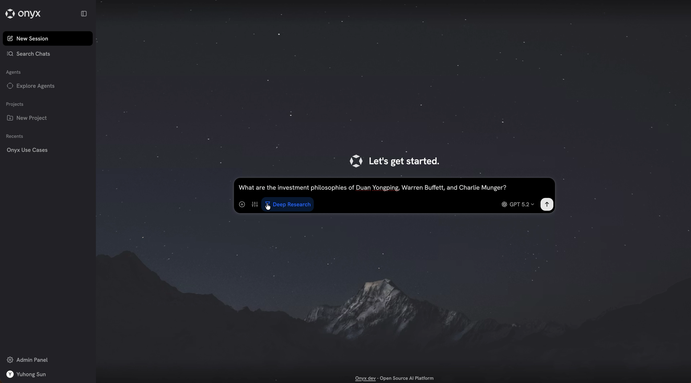
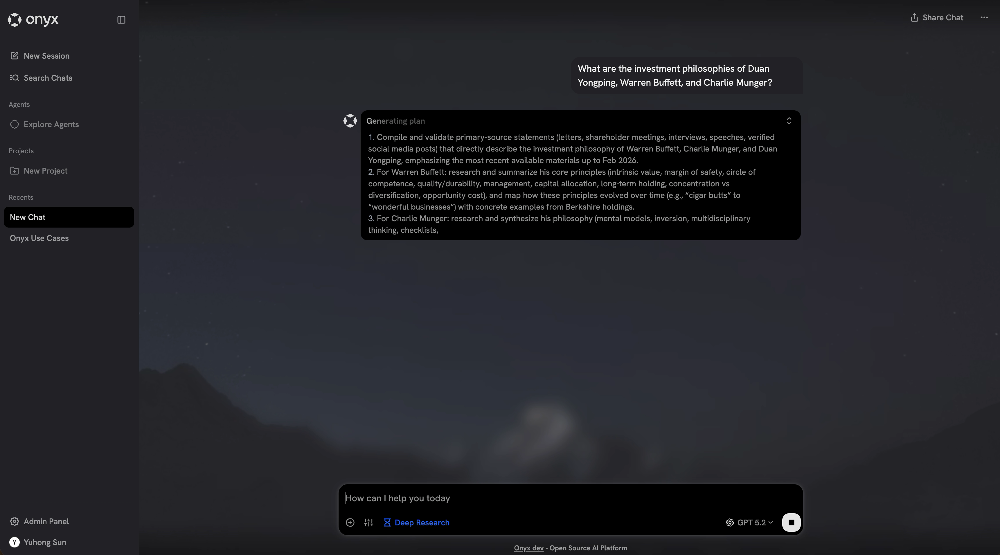
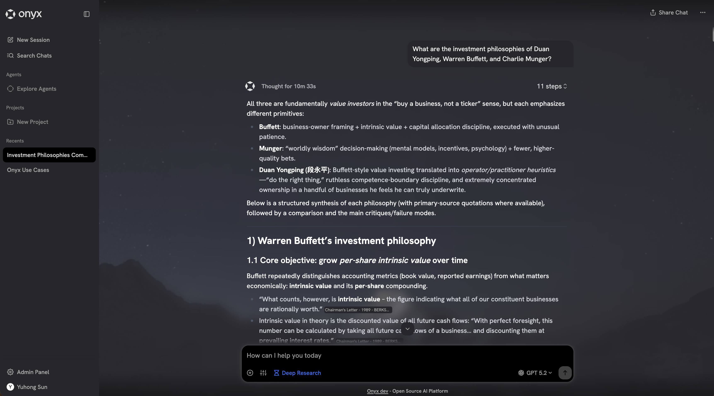

<div align="center"></div>
<h1 align="center">Onyx Deep Research Benchmark Results</h1>

# Overview

This repository contains the Onyx submission to the [Deep Research Benchmark](https://github.com/Ayanami0730/deep_research_bench).

The latest leaderboard can be accessed here: [Deep Research Benchmark Leaderboard](https://huggingface.co/spaces/muset-ai/DeepResearch-Bench-Leaderboard).

# Benchmark Performance

| Rank | Model | Overall | Comprehensiveness | Insight | Instruction Following | Readability |
|:----:|-------|:-------:|:----:|:-------:|:--:|:----:|
| 1 | Onyx | **54.92** 🥇 | **55.07** 🥇 | **57.10** 🥇 | **52.99** 🥇 | *52.41* 🥈 |
| 2 | Cellcog | *54.54* 🥈 | *54.43* 🥈 | *56.22* 🥈 | *52.76* 🥈 | **53.14** 🥇 |
| 3 | Qianfan-DeepResearch Pro| 54.22 | **55.07** 🥇 | 56.09 | 51.77 | 52.12 |
| 4 | Qianfan-DeepResearch | 53.07 | 52.65 | 55.44 | 51.61 | 51.21 |
| 5 | Tavily Research | 52.44 | 52.84 | 53.59 | 51.92 | 49.21 |
| 6 | Thinkdepthai DeepResearch | 52.43 | 52.02 | 53.88 | 52.04 | 50.12 |
| 7 | Salesforce AIR | 50.65 | 50.00 | 51.09 | 50.77 | 50.32 |
| 8 | LangChain Open Deep Research (GPT-5, with Gensee search) | 50.60 | 50.06 | 50.76 | 51.31 | 49.72 |
| 9 | Gemini 2.5 Pro Deep Research | 49.71 | 49.51 | 49.45 | 50.12 | 50.00 |
| 10 | LangChain Open Deep Research (GPT-5 with Tavily) | 49.33 | 49.80 | 47.34 | 51.05 | 48.99 |

> **Legend:** 🥇 = best in column · 🥈 = second best · **Bold** = 1st place · *Italic* = 2nd place

### Other Notable Mentions:
| Rank | Model | Overall | Comprehensiveness | Insight | Instruction Following | Readability |
|:----:|-------|:-------:|:----:|:-------:|:--:|:----:|
| 11 | OpenAI Deep Research | 46.45 | 46.46 | 43.73 | 49.39 | 47.22 |
| 12 | Claude Research | 45.00 | 45.34 | 42.79 | 47.58 | 44.66 |
| 17 | Perplexity Deep Research | 40.46 | 39.1 | 35.65 | 46.11 | 43.08 |

# Onyx Deep Research
<div align="center">
  
  <br/>
  
  
</div>

# Additional Info
Onyx is a production system with an emphasis on user experience. Additional product/UX constraints that we feel are important which were taken into account for the generation of the answers for the benchmark are as follows:
- All research + answer generations for any given question are capped to 30 minutes maximum.
- Outputs were tuned for human usability and conciseness - the reports are typically around 10,000 tokens (though the longest can be upwards of 20,000 tokens).
- The biggest allowed latency between any user facing output is 2 minutes.

## Reproducing Results
The reports submitted for the benchmark were produced using [this](https://github.com/onyx-dot-app/onyx/releases/tag/nightly-latest-20260207) nightly build of Onyx.
External dependencies used for this particular set of results were:
- LLM: [GPT-5.2](https://openai.com/index/introducing-gpt-5/)
- Web Search API: [Serper](https://serper.dev/)
- Web Crawler: [Firecrawl](http://firecrawl.dev/)

The same Deep Research flow can be run with other LLMs and Web Search/Crawler APIs (or Onyx's built in), but results will vary based on the setup.

## Files Included
All of the standard files for the benchmark in their standard format are included under `eval_results`:
- `onyx_raw_results.jsonl` contains the raw final outputs from the Onyx system.
- `onyx_cleaned_results.jsonl` contains the same contents as above but citations are stripped.
- `raw_results.jsonl` contains the scores across all of the metrics for each of the reports individually.
- `race_result.txt` contains the final aggregate scores.

The `report_logs` directory contains all of the reports along with all of the research agent tasks. The research agent tasks are unique to the Onyx system, they are not required for the benchmark and simply included for the reader's interest.

# Acknowledgements
Thank you to the DeepResearch Bench team for creating the benchmark and maintaining the leaderboard!

> Du, M., Xu, B., Zhu, C., Wang, X., & Mao, Z. (2025). DeepResearch Bench: A Comprehensive Benchmark for Deep Research Agents. *arXiv preprint* [arXiv:2506.11763](https://arxiv.org/abs/2506.11763).

**BibTeX:**
```bibtex
@article{du2025deepresearch,
  title={DeepResearch Bench: A Comprehensive Benchmark for Deep Research Agents},
  author={Du, Mingxuan and Xu, Benfeng and Zhu, Chiwei and Wang, Xiaorui and Mao, Zhendong},
  journal={arXiv preprint arXiv:2506.11763},
  year={2025},
  url={https://arxiv.org/abs/2506.11763}
}
```
